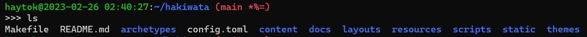

bash のプロンプトの表示を以下のように調整してみた。追加で`日時と時刻`と `git のブランチ名`を表示させるようにした。

## 参考

- [bashのプロンプトを変更するには](https://atmarkit.itmedia.co.jp/flinux/rensai/linuxtips/002cngprmpt.html)
- [Bash プロンプトに日付と時刻を入れる - Neo's World](https://neos21.net/blog/2019/04/17-01.html#google_vignette)
- [bashでgitのブランチ名を表示させる。 - Qiita](https://qiita.com/kuniatsu/items/e2de0d37cdb63b77fbd4)
