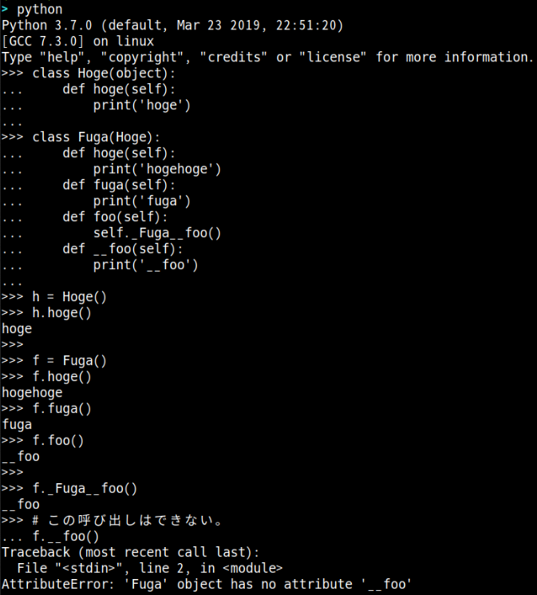
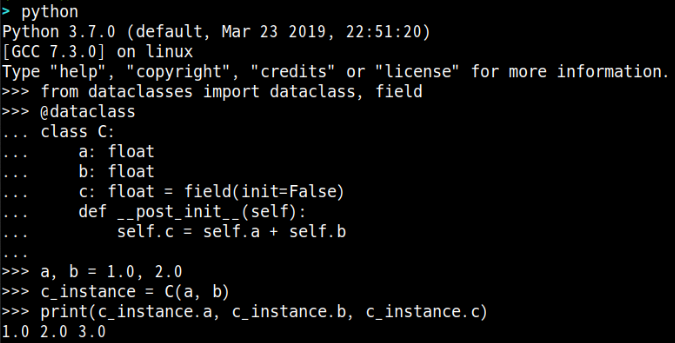
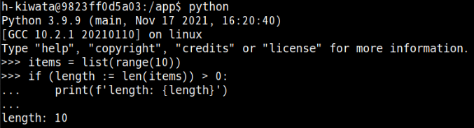
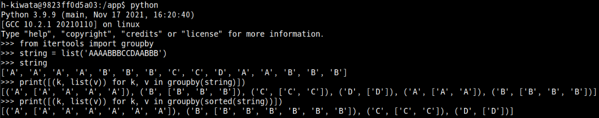

## 概要

- Python 関連の記事を読んだ際のメモを残す。

## 記事とメモ

- [Python メモ – プライベート メソッド](https://www.nikutama.com/2019/10/13/python-memo-private/)
  - 関数名にの先頭に `__` が付くと、プライベートメソッドになり、普通の呼び出し方では呼び出せない。しかし、どうしても呼び出したい時は、`(インスタンス名)._(クラス名)(プライベートメソッド名)` で呼び出すことが可能である。

- [Python メモ – データクラス](https://www.nikutama.com/2019/11/17/python-memo-dataclass/)
  - `@dataclasses` をクラスにデコレートしメンバ変数に型と共に宣言する。そうすると、以前は必要だった `__init__` メソッドの `self` 以降に指定する変数とその初期化を省略することができる。
  - ちなみに、以下の画像のように `__init__` が呼び出される際に、定義した関数を呼び出すこともできる。
  - [dataclasses --- データクラス](https://docs.python.org/ja/3/library/dataclasses.html)

- [Python メモ – セイウチ演算子](https://www.nikutama.com/2019/12/08/python-memo-walrus-operator/)
  - セイウチ演算子により広いスコープに変数を宣言しなくて済むので非常に便利な演算子である。ただし、Python 3.8 以降でないと使えない。
  - C++ の if などで使用した記憶があり、便利な印象だった。
  - [代入式](https://docs.python.org/ja/3/whatsnew/3.8.html#assignment-expressions)

- [Python メモ – 設定ファイル](https://www.nikutama.com/2019/10/16/python-memo-configparser/)
  - uwsgi.ini といった `ini ファイル` を読み出す際に使える標準ライブラリである。[python-dotenv](https://pypi.org/project/python-dotenv/) の `ini ファイル` バージョンである。
  - [configparser --- 設定ファイルのパーサー](https://docs.python.org/ja/3/library/configparser.html)

- [Python メモ – REST APIのテスト](https://www.nikutama.com/2019/12/01/python-memo-tavern/)
  - REST API のテストコードを書くのに `Tavern` があるらしい。毎回テストを書かずに終わってしまっているので、次書く機会がある時は参考にしたい。
  - [Tavern API Testing](https://tavern.readthedocs.io/en/latest/index.html)

- [Python メモ – unittest](https://www.nikutama.com/2019/10/26/python-memo-unittest/)
  - 基本的なテスコードの書き方は知っていた。しかし、エラーのテスコードの書き方も学べて面白かった。
  - `unittest` では、`python -m unittest discover` でカレントディレクトリを起点に `test*.py` にマッチするテストコードを再帰的に探して実行してくれる。

- [itertools.groupby(iterable, key=None)](https://docs.python.org/ja/3/library/itertools.html#itertools.groupby)
  - 初めて認知した標準ライブラリだった。各要素を先頭から操作していき、グルーピングしたオブジェクトを返す関数である。

## 参考

- [pythonのアンダーバーこれなんやねん](https://qiita.com/kiii142/items/6879cb065ad4c5f0b901)
