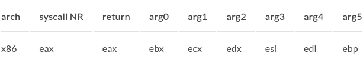
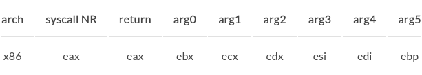

## 概要

- こんにちは！[前々回の記事](https://haytok.jp/post/20210618/)で Table を表現する Markdown が上手く表示されないバグにハマってしまいました。今回は、そのバグをどのように調査して解決したかについての記録を残したいと思います。

## 背景

- [前々回の記事](https://haytok.jp/post/20210618/)で CPU のアーキテクチャとレジスタの関係を表す表を記述しました。その Markdown の抜粋は以下になります。

```markdown
| arch | syscall NR |
| :---: | :---: |
| x86 | eax |
```

- このように記述すると、表の中の文字列が中央揃えに表示される想定でした。しかし、表示結果は以下のように左揃えになっています。



- これは、想定していた挙動と違っていました。HTML で言うところの、`table タグ` の `align 属性` が適用されていません。そのため、この Markdown の記述で表の文字列が中央揃えになるようにトラブルシューティングとその改善をしたいと思います。

## 目的

- Table の中央揃えと右揃えを表す Markdown が上手く Parse されない原因を明らかにし、改善するプロセスを振り返ることがこの記事の目的です。まず、この原因が Hugo 側にあるのか、あるいは Markdwon Parser に原因があるのか、あるいはそれ以外なのかを調査します。そしてその調査結果に基づいて不具合を修正します。

## 調査プロセスと解決方法

- この問題の原因は大きく 2 つに分けられます。Hugo に問題があるケースと Markdown Parser に問題があるケースです。そこで、まず、Hugo が採用している Markdown Parser 側からの調査を行いました。

- 初めに、Hugo で使われている Markdown Parser を調べました。これは、普通にググれば出てきます。`Hugo v0.60.0` から [goldmark](https://github.com/yuin/goldmark) が採用されているそうです。この背景は、[goldmarkがHugoに採用された](http://inforno.net/articles/2019/12/25/hugo-now-uses-goldmark)や[Now CommonMark Compliant!](https://gohugo.io/news/0.60.0-relnotes/)の記事が参考になります。

- 次に、この [goldmark](https://github.com/yuin/goldmark) のソースコードの中で、Table 記法の Markdown を Parse する箇所を最初に確認しました。そもそも Parse するロジックが実装されているかを調査するためです。今回は、GitHub の左上の検索ボックスで `table` の文字列を入力して検索を行いました。実際に Table 記法を Parse してそうなファイルに当たりをつけました。そのファイルは以下です。

1. [goldmark/extension/ast/table.go](https://github.com/yuin/goldmark/blob/75d8cce5b78c7e1d5d9c4ca32c1164f0a1e57b53/extension/ast/table.go)
2. [goldmark/extension/table.go](https://github.com/yuin/goldmark/blob/75d8cce5b78c7e1d5d9c4ca32c1164f0a1e57b53/extension/table.go)
3. [goldmark/extension/table_test.go](https://github.com/yuin/goldmark/blob/75d8cce5b78c7e1d5d9c4ca32c1164f0a1e57b53/extension/table_test.go)
4. [goldmark/extension/_test/table.txt](https://github.com/yuin/goldmark/blob/75d8cce5b78c7e1d5d9c4ca32c1164f0a1e57b53/extension/_test/table.txt)

- 初めは、各ファイルに目を通していき、Parse のロジックがどの関数で行われているかを調査していました。しかし、よくよく考えると、<span style="color:#e47911;">テストコード</span>を確認して、問題となるケースが正常に加味されているかを確認することを優先しました。そこで、検索結果の 1 つである [goldmark/extension/table_test.go](https://github.com/yuin/goldmark/blob/75d8cce5b78c7e1d5d9c4ca32c1164f0a1e57b53/extension/table_test.go) のソースコードを確認しました。すると、以下の Markdown を [goldmark](https://github.com/yuin/goldmark) の関数 に入力すると、align 属性を考慮した table タグのある HTML を吐き出す関数のテストが実装されていました。そのため、おそらく align 属性を Parse する Table 記法のロジックが実装されていることがわかりました。これらの調査により、Hugo 側に問題がありそうだと推測しました。


| abc | defghi |
:-: | -----------:
bar | baz



<table>
    <thead>
        <tr>
            <th align="center">abc</th>
            <th align="right">defghi</th>
        </tr>
    </thead>
    <tbody>
        <tr>
            <td align="center">bar</td>
            <td align="right">baz</td>
        </tr>
    </tbody>
</table>


---

- 次に、Hugo で使用されている [goldmark](https://github.com/yuin/goldmark) のバージョンの関係性について調査を行いました。検索ワードを変えつつググっていると、[Obsolete attribute align on td with Goldmark](https://discourse.gohugo.io/t/obsolete-attribute-align-on-td-with-goldmark/25021) という記事に辿り着きました。この記事を読むと、[goldmark](https://github.com/yuin/goldmark) の GitHub の [issue#7244](https://github.com/gohugoio/hugo/issues/7244) へのリンクが貼られていました。この issue を読むと、Hugo のバージョンが `v0.75` 以上であれば、Markdown の Table 記法が適切に Parse されそうな雰囲気が感じられました。そこで、まず以下のコマンドで自分の環境の Hugo のバージョンを確認してみました。

```bash
> hugo version
Hugo Static Site Generator v0.65.3-211BA42A linux/amd64 BuildDate: 2020-02-23T09:59:37Z
```

- これにより、Hugo のバージョンが `v0.65.3` とかなり古いバイナリを使用していることがわかりました。したがって、issue にあったように、ひとまず Hugo のバージョンを上げることを検討しました。Docker を使って Hugo のバージョンが `v0.83.1` であるバイナリを使用して開発用サーバを起動して挙動を確認しました。その結果、以下の画像のように表の中の文字列が中央揃えになりました。やはり、Hugo のバージョンが低いことが悪かったようです。



## 感想

- こうして、意図を持って Hugo のバージョンを上げることで、問題を解決することができました。段階を踏んで調査した結果、意図した挙動をした瞬間はとても嬉しかったです。これからもバグを踏んだりしたときは、落ち着いて修正をしていければと思いました。

## 参考

- [goldmarkがHugoに採用された](http://inforno.net/articles/2019/12/25/hugo-now-uses-goldmark)
- [Now CommonMark Compliant!](https://gohugo.io/news/0.60.0-relnotes/)
- [Obsolete attribute align on td with Goldmark](https://discourse.gohugo.io/t/obsolete-attribute-align-on-td-with-goldmark/25021)
- [issue#7244](https://github.com/gohugoio/hugo/issues/7244)
