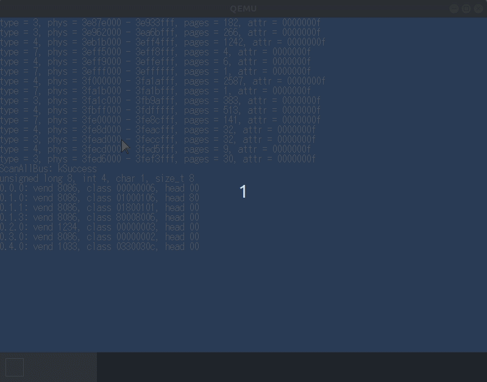
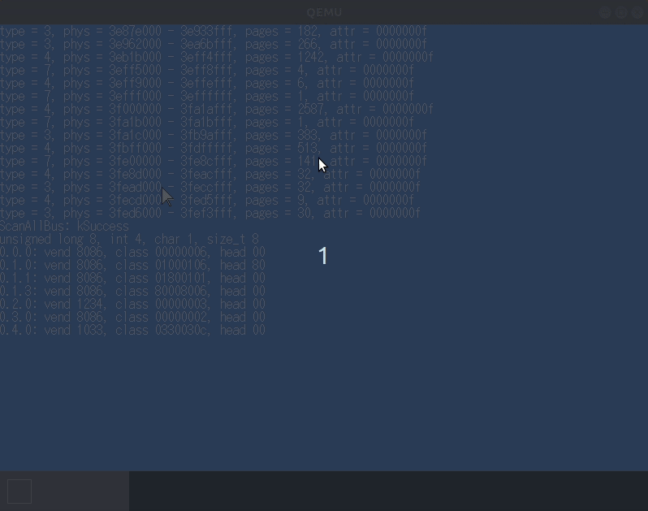
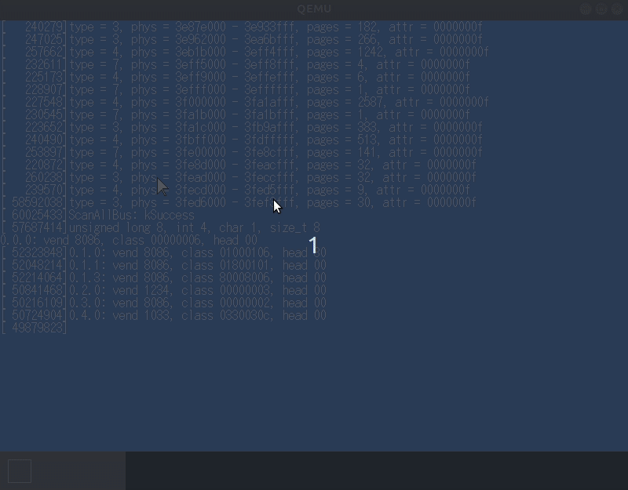
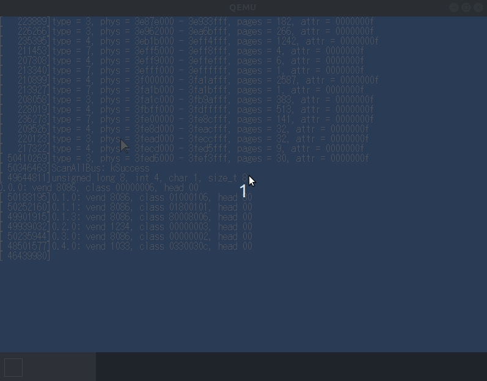
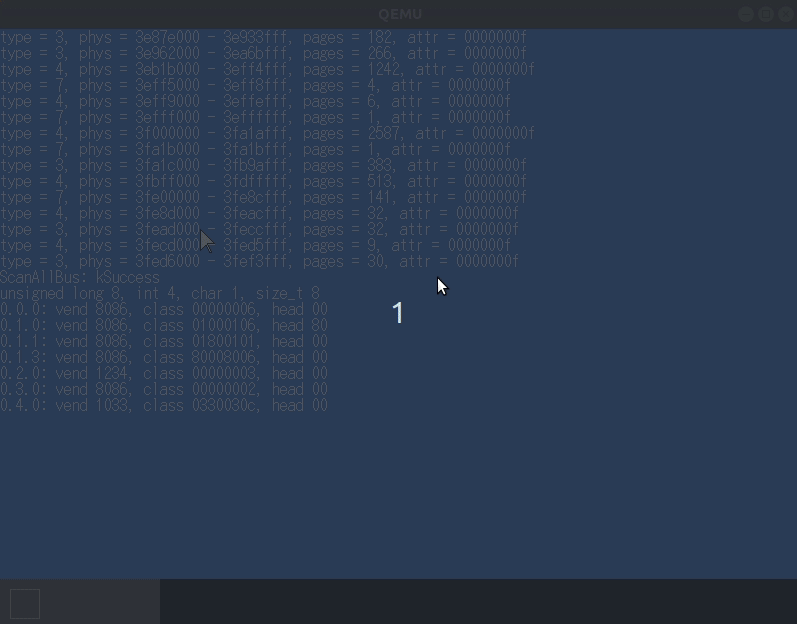
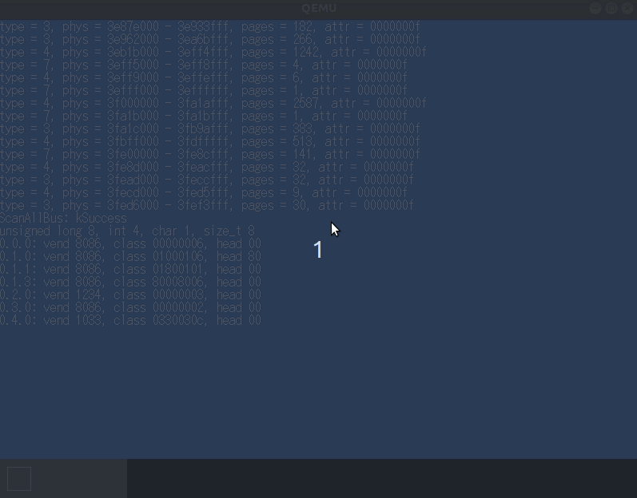
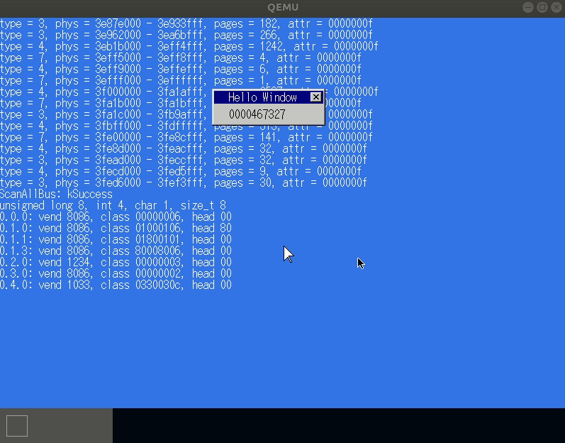
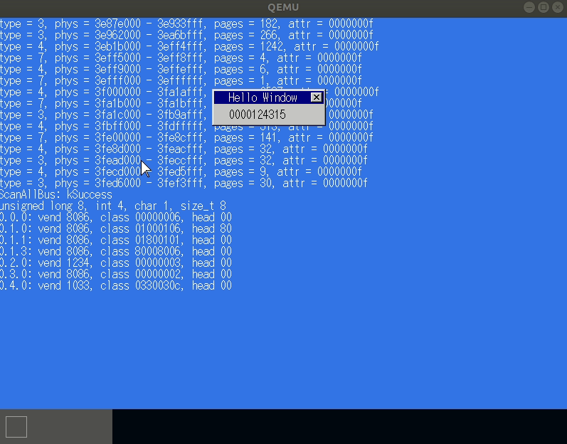
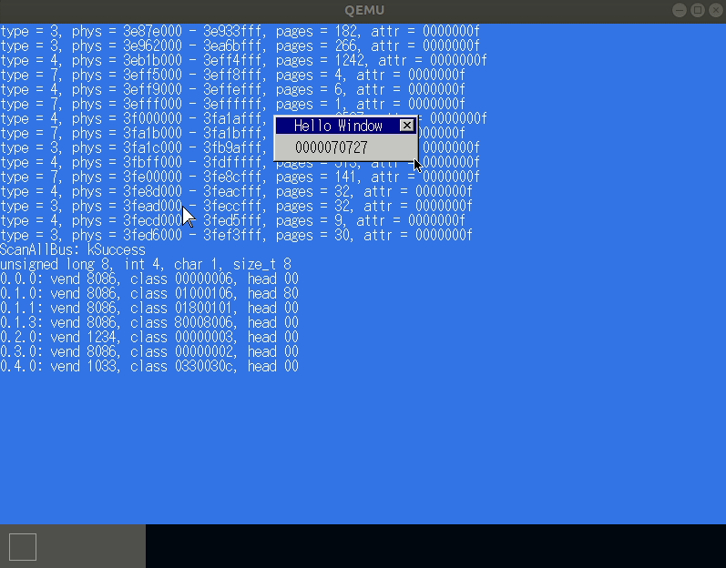

## 概要

- こんにちは！最近、研究室の隣の同期に影響されて自作 OS を始めました。そこで、今回は自作 OS が成長していく様子を日記としてこの記事に残したいと思います。このエントリでは 1 ~ 10 章までの記録を残したいと思います。

## 日記



### 2021 年 8 月 13 日



#### 

- 自作 OS を始めました！名前は HonOS です！名前の由来は櫻坂46 の田村保乃ちゃんのあだ名の「ほのす」から付けました。





### 2021 年 8 月 28 日

#### osbook_day09b

#### osbook_day09c

#### osbook_day09d

### 2021 年 8 月 29 日

#### osbook_day09e

### 2021 年 8 月 29 日

#### osbook_day10a

#### osbook_day10b-invalid

- `FrameBuffer::Copy` の実装が間違っていたせいで表示がバグってしまいました。状況を切り分けつつバグを調査する過程が最高に楽しかったです。

#### osbook_day10b

- ウィンドウを表示することができました！

#### osbook_day10c

- Kernel の main 関数の for ループ回数を書き込んだウィンドウを表示することができました！

### 2021 年 8 月 30 日

- しかし、この記事を見た同期に表示されている色の挙動がおかしいと指摘されました。そこで、[osbook_day10c](https://github.com/uchan-nos/mikanos/tree/osbook_day10c) に checkout し、正常系の挙動を確認してみました。そうすると、確かに正常系と比較すると、挙動がおかしかったので、バグを調査し修正しました。原因は `constexpr PixelColor ToColor(uint32_t c);` の色のビットシフトが逆になっていたことでした。だいぶ画面がチカチカしていますが、そのリファクタリングは次節以降でできればと思っています！

### 2021 年 8 月 31 日

#### osbook_day10d

#### osbook_day10e

- この節では、バックバッファに描画を行った後に、バックバッファをフレームバッファに転送を行います。こうして転送を行うことで、マウスカーソルが表示されない期間を完全になくし、カウンタにマウスを重ねた時のチラツキをなくすことができます。

##### 参考

- [ゼロからOS自作入門 10章](https://zenn.dev/link/comments/85cef9483586e5)
- [【OpenGLでゲームを作る】ダブルバッファリングとは](https://nn-hokuson.hatenablog.com/entry/2014/01/15/164232)
- [ダブルバッファリング 【double buffering】 ](https://e-words.jp/w/%E3%83%80%E3%83%96%E3%83%AB%E3%83%90%E3%83%83%E3%83%95%E3%82%A1%E3%83%AA%E3%83%B3%E3%82%B0.html)
- [描画処理について](http://codebock.web.fc2.com/sec02_03.html)

#### osbook_day10f

- USB ドライバからデータを取り出すプログラムは、マウスのボタンが押されたかとマウスがどれだけ移動したかの変位を取得できる機能のものでした。しかし、なぜかドライバから Kernel にそれらのデータが渡されませんでした。`make clean` や `rm kernel.elf` を実行し、クリアな状況にしても状況が改善されませんでした。そこで、`Makefile` を本家からコピーすると正常な動きをするようになりましたが、なぜデータが Kernel 側に受け渡されなかったかの原因が不明のまま解決してしまいました。

#### osbook_day10g

## 参考

- [honOS](https://github.com/haytok/honOS)
- [mikanos](https://github.com/uchan-nos/mikanos)
