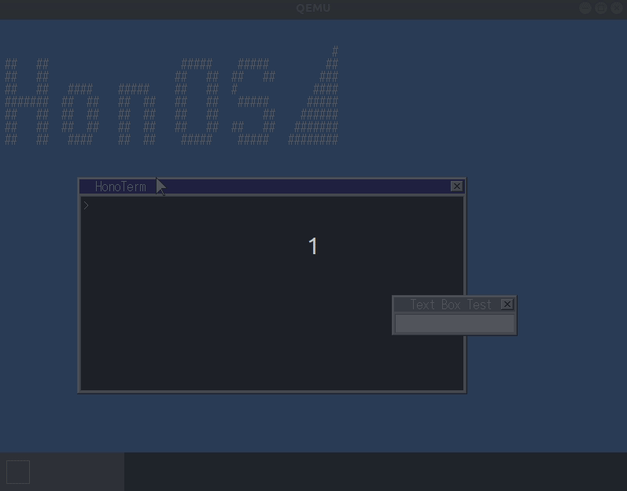

## 概要

- こんにちは！前回に引き続き自作 OS 日記を付けたいと思います。このエントリでは 21 ~ 30 章までの記録を残したいと思います。

## 日記



### 2021 年 9 月 25 日

#### osbook_day21a

- IST を設定しました！



#### osbook_day21b

- `rpn コマンド` で引き算した結果をターミナルに出力するためのシステムコールを実装した。だいぶ身近な箇所の実装にまで辿り着いてさらに楽しくなってきた。


### 2021 年 9 月 26 日

#### osbook_day21c

- 終了のシステムコールを実装しました！この実装により、`rpn` コマンドで足し算や引き算をした結果を出力し、制御をターミナルに戻すことができます。


- 今回は、解説されているプログラムをアプリケーション側から写経していきました。つまり、`apps/rpn/rpn.cpp` の `main 関数` 内で `SyscallExit` を呼び出すことから実装を始めました。これは、前節ではアセンブリから実装を始めたので、視点を変えたかったためです。

- この節を実装して特に感じたことがあります。それは、節によっては説明が前後するため、紹介されているプログラムを読んで直後の解説を読んでもわけがわからないときが多々あることです。自分は紹介されているプログラムが自分で理解できる時は、プログラムを読んで自分なりの解釈を作ってから直後に書かれている解説を読むようにしています。しかし、プログラムを読んでなぜこの実装にしたのかの意図が全くわからず、直後の解説を読んでも特に触れられていない時があります。その時は、その実装の解釈に対してめちゃくちゃ悩み、妥協して読み進めるしかありません。そして、読み進めると、後の方のページでそのプログラムに対する解説を見つけると、何やねんと思ったりすることもありました。紙面や解説の都合上こうなるのはしょうがないと思うのですが、おいってなります。そのため、自分のこの本の読み方を改めつつ、もっと多くの知識を付けたいと思いました。


### 2021 年 9 月 27 日

#### osbook_day21d

- アプリケーションが増えてきたので、アプリケーションのリファクタリングを行いました。UI に特に変更はありません。


#### osbook_day21e

- ウィンドウを開くシステムコールを実装しました。




#### 

- 前節で実装したシステムコールに機能を加え、開いたウィンドウに文字を表示させました。




### 2021 年 9 月 28 日



#### 

- `exit システムコール` を実装しました。これまで `SyscallExit` と記述していた実装を `exit` に書き換えて C の標準ライブラリを使うように修正しました。しかし、以下のように `_exit` が定義されていないというエラ−が出ます。そこで、エラーログに書かれているように `apps/newlib_support.c` に `_exit` を定義し、諸々の修正を行いました。その結果、最終的にはライブラリ関数の `exit` を呼び出すことでアプリケーションを終了させることができました。

```bash
clang++     -I/home/h-kiwata/osbook/devenv/x86_64-elf/include/c++/v1 -I/home/h-kiwata/osbook/devenv/x86_64-elf/include -I/home/h-kiwata/osbook/devenv/x86_64-elf/include/freetype2     -I/home/h-kiwata/edk2/MdePkg/Include -I/home/h-kiwata/edk2/MdePkg/Include/X64     -nostdlibinc -D__ELF__ -D_LDBL_EQ_DBL -D_GNU_SOURCE -D_POSIX_TIMERS     -DEFIAPI='__attribute__((ms_abi))' -I. -O2 -Wall -g --target=x86_64-elf -ffreestanding -mcmodel=large -fno-exceptions -fno-rtti -std=c++17 -c rpn.cpp -o rpn.o
ld.lld -L/home/h-kiwata/osbook/devenv/x86_64-elf/lib --entry main -z norelro --image-base 0xffff800000000000 --static -o rpn rpn.o ../syscall.o ../newlib_support.o -lc -lc++ -lc++abi
ld.lld: error: undefined symbol: _exit
>>> referenced by exit.c
>>>               lib_a-exit.o:(exit) in archive /home/h-kiwata/osbook/devenv/x86_64-elf/lib/libc.a
../Makefile.elfapp:12: recipe for target 'rpn' failed
make[1]: *** [rpn] Error 1
make[1]: ディレクトリ '/home/h-kiwata/honOS/apps/rpn' から出ます
Makefile:3: recipe for target 'build' failed
make: *** [build] Error 2
```





#### 

- 星が描画されたウィンドウを出すアプリケーションを実装しました。





#### 

- タイマカウントを取得するためのシステムコールを追加しました。。





#### 

- 画面の描画の最適化を行いました。gif からもわかるように前節と比較して描画時間が高速になりました。




### 2021 年 9 月 29 日



#### 

- `lines` アプリケーションを実装しました。点をブロットして線を表現しているのですが、 gif の上の方は、傾きが大きくなるほど点の間隔が広くなり上手く描画できていません。それに改善を加えたのが下の方の gif です。下の gif では傾きが急になっても点と点の間隔が広くないような工夫を施しています。











#### 

- アプリケーションのウィンドウを閉じるロジックを追加しました。現時点ではアプリケーションを開くとすぐに終了してしまいます。次節でコマンドでアプリケーションを終了できるように修正します。





#### 

- `Ctrl + Q` でアプリケーションを閉じる機能を追加しました。これでアプリケーションを閉じることができます！



### 2021 年 9 月 30 日



#### 

- Ubuntu の `xeyes` のようなアプリケーションを実装しました。アプリケーションを起動しアクティブな状態だと、マウスが移動する方向にアプリケーションのウィンドウ内の点が移動します。





#### 

- マウスの左ボタンをクリックしながらペイントウィンドウ内でカーソルを移動させると、文字を書くことができる機能を実装しました。




### 2021 年 10 月 1 日


#### 

- 一定時間スリープするコマンド `timer` コマンドを実装しました。




#### 

- `cube` コマンドを実装しました。




#### 

- この節では、ブロック崩しコマンド `blocks` を実装しました。

- このコマンドを実装する際に、 `newlib_support.c` に不足するライブラリ関数を追加する必要があります。それらの関数は、Kernel をビルドする際に現れる以下のエラーから確認できます。それらは、`getpid` と `kill` です。

```bash
ld.lld -L/home/h-kiwata/osbook/devenv/x86_64-elf/lib --entry main -z norelro --image-base 0xffff800000000000 --static -o blocks blocks.o ../syscall.o ../newlib_support.o -lc -lc++ -lc++abi -lm
ld.lld: error: undefined symbol: kill
>>> referenced by signalr.c
>>>               lib_a-signalr.o:(_kill_r) in archive /home/h-kiwata/osbook/devenv/x86_64-elf/lib/libc.a

ld.lld: error: undefined symbol: getpid
>>> referenced by signalr.c
>>>               lib_a-signalr.o:(_getpid_r) in archive /home/h-kiwata/osbook/devenv/x86_64-elf/lib/libc.a
../Makefile.elfapp:12: recipe for target 'blocks' failed
make[1]: *** [blocks] Error 1
make[1]: ディレクトリ '/home/h-kiwata/honOS/apps/blocks' から出ます
Makefile:3: recipe for target 'build' failed
make: *** [build] Error 2
```

- きちんと条件分岐のロジックを設定しないと、文字列がダブって入力されてします。




- 以下の画像からもわかるようにブロック崩しゲームを実装できました。





#### 

- `F2` キーを押下すると、新しいターミナルが起動します。しかし、新しく起動したターミナルのカーソルは点滅しません。次節以降でこの問題点を解消していきます。




#### 

- アクティブなウィンドウのカーソルが点滅するように修正を行いました。




#### 

- 以下の上側の gif からもわかるように複数のターミナルから複数のアプリケーションを起動できません。これは、仮想メモリ領域が競合しているからです。本節では、このバグを解消します。




- アプリケーション毎に仮想メモリ領域を切り替えるように修正を行いました。その結果、複数のターミナルから複数のアプリケーションを実行することができました。





#### 

- ウィンドウの重なりのバグを修正しました。








#### 

- ターミナルを束縛せずにアプリケーションを起動させるように修正しました。




### 2021 年 10 月 2 日


#### 

- 本節では、意図的にアプリケーションがフリーズするコマンド `fault` を作成します。このコマンド
はアプリケーションがフリーズした時に上手にハンドリングを行う際に次節で活用します。




#### 

- アプリケーションが落ちた時の例外処理を実装しました。




#### 

- `ls` コマンドを実行した際に、ディレクトリ配下のエントリも表示するように修正しました。




#### 

- ファイルの中身を読み出すアプリケーション `readfile コマンド` を実装しました！

- 途中でシステムコール内でバグがあったのですが、`Log 関数` を活用してバグのありそうな箇所を起点に二分探索風に調査を行いました。その結果、if 文の条件式の間違いに気づけました。バグの調査はヒヤヒヤするのですが、解決できると嬉しいです😁




#### 

- `grep コマンド` を実装しました！




### 2021 年 10 月 5 日


#### 

- エコーバックを実装しました！
- 3 回文字列を入力すると、exit する原因はわかりませんでした。




#### 

- 例えば `grep コマンド` を実行すると、制御がターミナルに戻ってきません。そこで、この節では、`Ctrl + D` を押すことで、アプリケーションを停止する機能を実装しました！




#### 

- ファイルを新規で作成するためのロジックを実装しました！ここでお馴染みの `File Descriptor` を扱いました！




#### 

- 新規で作成したファイルに書き込む機能を実装しました！つまり、`cp コマンド` を実行することができます。
- この節で必要な機能を一通り実装し、HonOS を起動させると、以下の画像の上のようにアプリケーションから制御がターミナルに戻らず、フリーズしました。そこで、いつも通り二分探索 print デバッグを行うと、前節で実装した `ExtendCluster 関数` の中の for 文の終了条件が間違っており、無限ループから抜けられないような実装になっていました ...
- デバッグ中は、最悪このバグが解決できなかった時は、この本をやりきった研究室の同期に相談しようと思っていましたが、自力で解決できた時はめっちゃ嬉しかったです😁















### 2021 年 10 月 5 日

- デマンドページングの機能を作成しました！


#### 




### 2021 年 10 月 12 日



#### 

- ファイルの内容をページキャシュから読み出すようにページフォルトを利用して実装を修正しました！




#### 

- メモリの使用量を計測するコマンド `memstat` を実装しました！次節でこのコマンドを活用してコピーオンライトで使用するメモリの量が節約できていることを確認します！




#### 

- アプリケーションを起動する際に、コピーオンライトで起動させるように修正しました。
- PML4 のシャローコピーを理解できませんでした。実装したいことの意図はわかるのだが、プログラムの意味を完全にはわかりませんでした。





#### 

- Unicode 対応の実装を行いました！情報理論や符号理論で扱いそうな符号化の話が出てきて面白かったです！




### 2021 年 10 月 14 日


#### 

- 日本語などを読み出せるように修正しました！




#### 

- リダイレクトの機能を実装しました！ファイルのディスクリプタ周りの処理を再度追って復習していたのですが、オブジェクト指向の複雑さにより呼び出している関数を勘違いしていました。どのオブジェクトの Read/Write 関数を呼び出しているかをキチンと把握することが大切であることを再認識しました。




### 2021 年 10 月 15 日


#### 

- 変数 `$?` に直前のアプリケーションの終了コードを格納するように修正しました！




#### 

- IPC の機能を実装し、パイプで跨いだコマンドの実行を可能にしました！




### 2021 年 10 月 16 日


#### 

- `sort コマンド` を実装しました！




#### 

- ターミナルのバグを修正しました！上の gif だとターミナルの更新が上手くいっていません。ターミナルに書き込む時の再描画の処理が不十分だったので、そのロジックを追加しました！










#### 

- アプリケーションにパスを通しました！ .bashrc などに記述するあれです。




#### 

- more コマンドを実装しました！基本的な C 言語のプログラミングで実装可能でした。




### 2021 年 10 月 17 日


#### 

- cat コマンドでファイル名を省略したときに標準入力から受け取れる機能を実装しました！




#### 

- ターミナルのアプリケーションのウィンドウを閉じるボタンを押すと、ウィンドウが閉じる機能を実装しました！具体的には、閉じるボタン上にカーソルがあるかの領域判定、マウスがクリックされた時のメッセージを送信する処理、ウィンドウを閉じるメッセージを受け取るとターミナルを消すロジックを追加しました。




#### 

- テキストビューアを実装しました！




#### 

- 画像を表示するアプリケーションを実装しました！これにてひとまず完走です🤞



## 参考

- [honOS](https://github.com/haytok/honOS)
- [mikanos](https://github.com/uchan-nos/mikanos)
