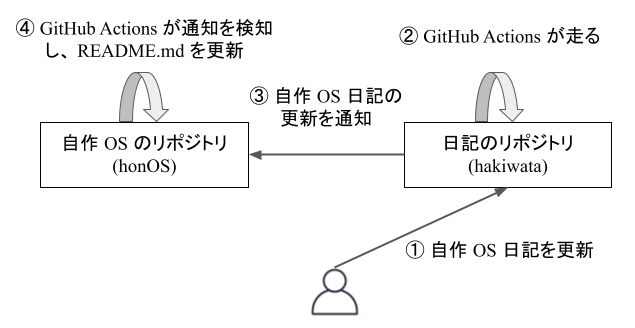

## 概要

- こんにちは！先月から [自作 OS](https://github.com/haytok/honOS) に取り組んでいます。その進捗を綴った日記は [自作 OS 日記](https://haytok.jp/post/20210830/) にあり、日記にはその日までに出来上がった OS の挙動を記録した GIF を載せています。これまでは、この日記を更新すると、手動で [自作 OS](https://github.com/haytok/honOS) のリポジトリの README.md に最新の OS GIF のリンクを貼り付けていました。ですが、最近、その作業がすごく面倒臭くなってきました。そこで、今回は [自作 OS 日記](https://haytok.jp/post/20210830/) を更新すると、 [自作 OS](https://github.com/haytok/honOS) のリポジトリの README.md も同時にアップデートされるように行った自動化の記録について書き残したいと思います。

## 方法

- 今回の自動化では、以下のようなパイプラインを構築しました。

- 一番のポイントは、リポジトリを跨いだ GitHub Actions のワークフローの連携です。これを実現するために、[Repository Dispatch](https://github.com/marketplace/actions/repository-dispatch) というアクションを使用しました。このアクションを用いて、[自作 OS 日記](https://haytok.jp/post/20210830/) のコンテンツ配下のみが更新されると、workflow が走るような設計になっています。

- このアクションでは、`client-payload` というペイロードを活用すると、通知先にデータを送信することができます。いわゆる HTTP の POST メソッドのようなことができます。したがって、日記を更新した段階で最新の GIF のリンクを取得できれば、このパラメータを活用して [自作 OS](https://github.com/haytok/honOS) リポジトリにその最新のファイル名を通知することができます。今回の自動化の流れでは、この最新の GIF のファイル名を Python と GitHub の API を用いて取得します。一番初めは、このやり方で実装を考えていたのですが、日記側のリポジトリと自作 OS 側のリポジトリの両方で Python のスクリプトを用意する必要がありました。これでは、双方のリポジトリに README.md を更新するために必要なスクリプトが存在してしまい、管理が面倒臭いです。

- そこで、[自作 OS 日記](https://haytok.jp/post/20210830/) のリポジトリでは日記の更新だけを検知するようにします。そして、[自作 OS](https://github.com/haytok/honOS) のリポジトリ側で [自作 OS 日記](https://haytok.jp/post/20210830/) のリポジトリの変更を検知すると、事前に用意した [Python のスクリプト](https://github.com/haytok/honOS/blob/main/scripts/main.py) で最新の OS の GIF のリンクの取得と README.md の更新を行うように実装しました。

## 余談

- 一番初めに考えていた `client-payload` を用いるやり方だと、Python のスクリプトを実行した結果を一旦 workflow の変数に保持する必要があります。その際に、[set-output コマンド]((https://docs.github.com/en/actions/reference/workflow-commands-for-github-actions#set-an-output-parameter-set-output)) が役立ちそうです。このコマンドを活用すると、ステップ間で結果を共有することができます。今回は、[自作 OS 日記](https://haytok.jp/post/20210830/) のリポジトリ側では変更を検知する通知を投げるだけなので、特に使用はしませんでしたが、今後活用できる機会が来るかも知れません。

## 最後に

- こうしてリポジトリ間の GitHub Actions の連携を行い、面倒臭い README.md の更新の自動化を実現しました。GitHub Actions は奥が深いのでもっと色々な機能を使ってみたいと思いました🤞

## 参考

- [Github Actions で他のリポジトリからの変更通知を受け取ってPRを作成する Workflow](https://zenn.dev/mizchi/articles/3117b92a834531361fc8)
- [GitHub Actionsを使ってリポジトリ間でファイルを機械的に同期する](https://qiita.com/a_jike/items/9d454bf1efad0370ae03)
- [Github Actions を API から実行する](https://qiita.com/okitan/items/88994a36c996f2397a07)
- [Repository Dispatch](https://github.com/marketplace/actions/repository-dispatch)

- [GitHub Actionsのset-outputに複数行の標準出力を代入する場合は改行コードをエスケープしてあげる必要がある](https://qiita.com/chanhama/items/415a0a26bbb186efc47a)
- [Workflow commands for GitHub Actions](https://docs.github.com/en/actions/reference/workflow-commands-for-github-actions)
