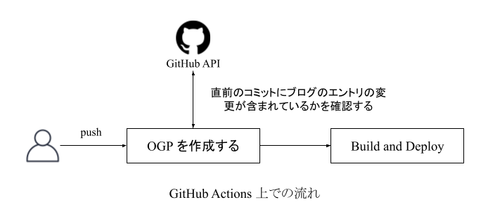

## 概要

- こんにちは！このブログを立ち上げてから約半年が経ちました。カスタマイズ性が高く簡単に運用できています。また、自分の書いた記事が積み重なっていく様子が可視化されるのが単純に嬉しいので、定期的なアウトプットに役立っています。そこで、今回はこのブログを作成するにあたって使用した技術などについて改めて振り返りたいと思います。

## 背景

- このブログには様々な機能を加えたりして工夫を行っています。具体的には以下の 8 つが挙げられます。過去にブログにまとめた記事もあるので、それ以外を補足しつつどう工夫してこのブログが成り立っているかについて説明したいと思います。

1. [Hugo と GitHub Pages を用いて開発](https://haytok.jp/post/20210430/)
2. 自動でデプロイするフローの導入 (CI/CD の構築)
3. [テンプレートを修正する](https://haytok.jp/post/20210611/)
4. [他のリポジトリとの連携](https://haytok.jp/post/20210911/)
5. [開発環境の Docker 化](https://haytok.jp/post/20210628/)
6. [バグの調査](https://haytok.jp/post/20210624/)
7. Google Analytics の導入
8. OGP の作成

- まず、1 に関して補足して説明します。このブログ (ポートフォリオ) は第三世代になります。第一世代は React + GitHub Pages のシンプルな構成で運用していました。あまり頻繁に更新するものでもなかったのですが、自動デプロイのパイプラインは構築していました。リポジトリは [haytok](https://github.com/haytok/haytok/tree/master) になります。第二世代は、React + Django + EC2 で運用していました。これは、単純にフロントエンドとバックエンドを分割させた形のアプリケーションを実装したかったという意図もあり、このような構成となりました。各アプリケーションは Docker と docker-compose を使用して Nginx のコンテナを経由して通信します。リポジトリは [hk-41](https://github.com/haytok/hk-41) になります。これらの 2 つのポートフォリオには単純に自己紹介をするページしかなく、ブログを投稿する機能がありませんでした。そこで、楽に運用でき拡張性も高い Hugo と GitHub Pages で新しく作り直したのがこのブログでした。

- 次に、2 に関して補足して説明します。`main ブランチ` に `About` と `Post` と `Scraps` の修正コードを push すると、GitHub Actions 上で設定したパイプラインが走ります。そうすると、ソースコードをビルドし自動でデプロイしてくれるようなフローを構築しています。この結果、デプロイのコマンドを逐一思い出す必要がなく、属人性を省いたデプロイができて嬉しいです。このブログは基本的には自分しか操作しない想定で作られています。そのため、プルリクを作成し、複数人の Approve を得てからデプロイを行うといった実務的なフローは構築していません。

- 最後に、8 に関して補足して説明します。このブログでは、各エントリに応じた OGP を生成したいと思っていました。特に各エントリのタイトルと日付を OGP に組み込む方針でした。この方針に基づき、2 のデプロイする直前に GitHub Actions 上で OGP を作成する Python のスクリプトが走るようになっています。こうして OGP の作成の自動化を図っています。また、OGP を作成するフローは以下のようになります。

## 最後に

- この記事を書き上げた時点で 18 エントリも積み上げることができました。初めはこのブログ自体を作るのが面倒くさかったのですが、定期的にアウトプットをすることができ、今ではこのブログを作って良かったと思っています。まだまだアウトプットしたいネタがたくさん溜まっているので、時間を見つけて書き上げていきたいと思います🤞
