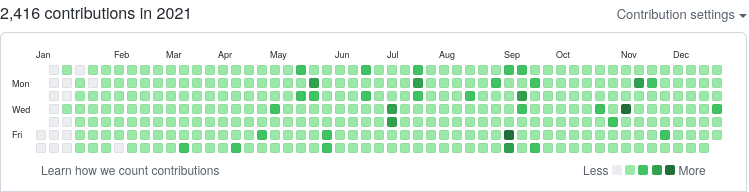

## 概要

- こんにちは！年末はお酒で大変なことになったため、今年の振り返りを書くのがすっかり遅れてしまいました。毎日付けた 11 冊のノートを基に学生生活最後の 1 年をザックリ振り返って行きたいと思います。

## 技術系

今年は、コンピュータや OS などの仕組みをできるだけ解像度を上げて理解したいと考え、試行錯誤した一年でした。

#### バイト
- [Django](https://www.djangoproject.com/) を使って Web アプリケーションのプロトタイプを開発しました。
- [Amazon Rekognition](https://docs.aws.amazon.com/ja_jp/rekognition/latest/dg/what-is.html) と [Amazon S3](https://aws.amazon.com/jp/s3/) を使って顔認証のアプリケーションを実装するための検証を行いました。

#### アプリケーションプログラミング関連
- [自作ブログ](haytok.jp) を開設しました。
  - アウトプットする習慣が付いたのと言語化能力が多少上がったのが良かったです。この記事を含めると、`21 記事`を投稿したようです。文章を書くという練習をこのブログを通して行ったことで、研究会の原稿や修論の執筆が卒論の時と比較すると、スムーズに行ったのではないかと思います。また、このブログを自分なりに色々アレンジしたりするのが楽しいです。
- GitHub の contribution の状況を LINE に通知するアプリケーションを実装しました。
  - このアプリケーションは、Golang + Docker + GitHub Actions で構成されます。contribution の状況を取得するには GraphQL で実装された GitHub API を呼び出す必要がありました。これまでこうして実装された API を呼び出したことはなく、取り組んだことが無い内容でした。ですが、GraphQL Client を駆使して馴染みのない Golang でアプリケーションを実装していく過程が非常に楽しかったです。

#### 技術書関連
- [コンピュータシステムの理論と実装 ―モダンなコンピュータの作り方](https://www.amazon.co.jp/%E3%82%B3%E3%83%B3%E3%83%94%E3%83%A5%E3%83%BC%E3%82%BF%E3%82%B7%E3%82%B9%E3%83%86%E3%83%A0%E3%81%AE%E7%90%86%E8%AB%96%E3%81%A8%E5%AE%9F%E8%A3%85-%E2%80%95%E3%83%A2%E3%83%80%E3%83%B3%E3%81%AA%E3%82%B3%E3%83%B3%E3%83%94%E3%83%A5%E3%83%BC%E3%82%BF%E3%81%AE%E4%BD%9C%E3%82%8A%E6%96%B9-Noam-Nisan/dp/4873117127) を読み切りました。
  - この本を基に [nand2tetris](https://github.com/haytok/nand2tetris) にあるプログラムを実装しました。 この本をキッカケにスタックで実行されるプログラムとコンパイラの内部実装に興味を持ちました。
- [はじめて学ぶバイナリ解析 不正なコードからコンピュータを守るサイバーセキュリティ技術](https://www.amazon.co.jp/%E3%81%AF%E3%81%98%E3%82%81%E3%81%A6%E5%AD%A6%E3%81%B6%E3%83%90%E3%82%A4%E3%83%8A%E3%83%AA%E8%A7%A3%E6%9E%90-%E4%B8%8D%E6%AD%A3%E3%81%AA%E3%82%B3%E3%83%BC%E3%83%89%E3%81%8B%E3%82%89%E3%82%B3%E3%83%B3%E3%83%94%E3%83%A5%E3%83%BC%E3%82%BF%E3%82%92%E5%AE%88%E3%82%8B%E3%82%B5%E3%82%A4%E3%83%90%E3%83%BC%E3%82%BB%E3%82%AD%E3%83%A5%E3%83%AA%E3%83%86%E3%82%A3%E6%8A%80%E8%A1%93-OnDeck-Books%EF%BC%88NextPublishing%EF%BC%89-%E5%B0%8F%E6%9E%97-%E4%BD%90%E4%BF%9D-ebook/dp/B084R85269) を読み切りました。
- [低レイヤを知りたい人のためのCコンパイラ作成入門](https://www.sigbus.info/compilerbook) を読み切りました。
  - この資料を基に [k8cc](https://github.com/haytok/k8cc) を実装してみました。
- [イラストでわかるDockerとKubernetes](https://www.amazon.co.jp/%E3%82%A4%E3%83%A9%E3%82%B9%E3%83%88%E3%81%A7%E3%82%8F%E3%81%8B%E3%82%8BDocker%E3%81%A8Kubernetes-Software-Design-plus-%E5%BE%B3%E6%B0%B8/dp/4297118378) を読み切りました。
  - コンテナの仕組みのハンズオンが面白かったです。来年はさらにコンテナランタイムに詳しくなります。
- [Goならわかるシステムプログラミング](https://www.lambdanote.com/products/go) を途中まで読んで、読むのをやめました。
  - シスプロが面白いと思っていたのが読み始めたキッカケでした。しかし、なぜか読まなくなりました。今では、ある程度 Golang が書けたりシスプロの知識も付いたので、来年には読み直したいと思います。
- [ふつうのLinuxプログラミング 第2版 Linuxの仕組みから学べるgccプログラミングの王道](https://www.amazon.co.jp/%E3%81%B5%E3%81%A4%E3%81%86%E3%81%AELinux%E3%83%97%E3%83%AD%E3%82%B0%E3%83%A9%E3%83%9F%E3%83%B3%E3%82%B0-%E7%AC%AC2%E7%89%88-Linux%E3%81%AE%E4%BB%95%E7%B5%84%E3%81%BF%E3%81%8B%E3%82%89%E5%AD%A6%E3%81%B9%E3%82%8Bgcc%E3%83%97%E3%83%AD%E3%82%B0%E3%83%A9%E3%83%9F%E3%83%B3%E3%82%B0%E3%81%AE%E7%8E%8B%E9%81%93-%E9%9D%92%E6%9C%A8-%E5%B3%B0%E9%83%8E/dp/4797386479) を読み切りました。
  - 演習問題も全て解き切りました。去年も一度読んだのですが、理解が更に進みました。やはりシスプロは楽しいです。
- [自作エミュレータで学ぶx86アーキテクチャ-コンピュータが動く仕組みを徹底理解!](https://www.amazon.co.jp/%E8%87%AA%E4%BD%9C%E3%82%A8%E3%83%9F%E3%83%A5%E3%83%AC%E3%83%BC%E3%82%BF%E3%81%A7%E5%AD%A6%E3%81%B6x86%E3%82%A2%E3%83%BC%E3%82%AD%E3%83%86%E3%82%AF%E3%83%81%E3%83%A3-%E3%82%B3%E3%83%B3%E3%83%94%E3%83%A5%E3%83%BC%E3%82%BF%E3%81%8C%E5%8B%95%E3%81%8F%E4%BB%95%E7%B5%84%E3%81%BF%E3%82%92%E5%BE%B9%E5%BA%95%E7%90%86%E8%A7%A3-%E5%86%85%E7%94%B0%E5%85%AC%E5%A4%AA/dp/4839954747) を途中まで読んで、読むのをやめました。
  - 読みにくい文章だったので、挫折してしまいました。
- [Build Your Own Text Editor](https://viewsourcecode.org/snaptoken/kilo/) を読んで自作エディタの [keditor](https://github.com/haytok/keditor) を実装してみました。
  - 資料が英語だったのですが、気合で読み切りました。この経験により、そもそも日本語の技術書を読む必要性は改めて無いのでは無いかと思うようになりました。そのため、来年はオライリーの英語の技術書を読んで行きたいと思いました。
- [Hacking: 美しき策謀 第2版 ―脆弱性攻撃の理論と実際](https://www.amazon.co.jp/Hacking-%E7%BE%8E%E3%81%97%E3%81%8D%E7%AD%96%E8%AC%80-%E2%80%95%E8%84%86%E5%BC%B1%E6%80%A7%E6%94%BB%E6%92%83%E3%81%AE%E7%90%86%E8%AB%96%E3%81%A8%E5%AE%9F%E9%9A%9B-Jon-Erickson/dp/4873115140) を読みました。
  - 低レイヤに関するセキュリティの勉強になりました。
- [セキュリティコンテストチャレンジブック -CTFで学ぼう! 情報を守るための戦い方-](https://www.amazon.co.jp/%E3%82%BB%E3%82%AD%E3%83%A5%E3%83%AA%E3%83%86%E3%82%A3%E3%82%B3%E3%83%B3%E3%83%86%E3%82%B9%E3%83%88%E3%83%81%E3%83%A3%E3%83%AC%E3%83%B3%E3%82%B8%E3%83%96%E3%83%83%E3%82%AF-CTF%E3%81%A7%E5%AD%A6%E3%81%BC%E3%81%86-%E6%83%85%E5%A0%B1%E3%82%92%E5%AE%88%E3%82%8B%E3%81%9F%E3%82%81%E3%81%AE%E6%88%A6%E3%81%84%E6%96%B9-%E7%A2%93%E4%BA%95-%E5%88%A9%E5%AE%A3/dp/4839956480) の Pwn に関連する章を読みました。
  - 低レイヤに関するセキュリティの勉強になりました。
- [基礎からわかるTCP/IP ネットワーク実験プログラミング（第2版）](https://www.ohmsha.co.jp/book/9784274065842/) を読み切りました。
  - `/usr/include` 配下のプログラムを参考にネットワークプロトコルを C 言語で実装したりしました。もともと自作プロトコルスタックに挑戦しようと思ったのですが、途中で挫折思想だと思ったのでこの本を読み始めました。この本はよくできていると思ったので、再度読み返したいと思っています。
- [プログラミングの基礎](https://www.amazon.co.jp/%E3%83%97%E3%83%AD%E3%82%B0%E3%83%A9%E3%83%9F%E3%83%B3%E3%82%B0%E3%81%AE%E5%9F%BA%E7%A4%8E-Computer-Science-Library-%E6%B5%85%E4%BA%95/dp/4781911609/ref=sr_1_6?__mk_ja_JP=%E3%82%AB%E3%82%BF%E3%82%AB%E3%83%8A&dchild=1&keywords=%E3%83%97%E3%83%AD%E3%82%B0%E3%83%A9%E3%83%9F%E3%83%B3%E3%82%B0%E3%81%AE%E5%9F%BA%E7%A4%8E&linkCode=qs&qid=1623256116&sourceid=Mozilla-search&sr=8-6) を読み切りました。
  - 扱ったことのないパラダイムのプログラミングを言語である関数型言語を書いてみたいと思ったのがこの本を読み始めた動機です。再帰の概念を言語レベルで学べたのは面白かったです。
- [ハロー“Hello, World” OSと標準ライブラリのシゴトとしくみ](https://www.amazon.co.jp/%E3%83%8F%E3%83%AD%E3%83%BC%E2%80%9CHello-World%E2%80%9D-OS%E3%81%A8%E6%A8%99%E6%BA%96%E3%83%A9%E3%82%A4%E3%83%96%E3%83%A9%E3%83%AA%E3%81%AE%E3%82%B7%E3%82%B4%E3%83%88%E3%81%A8%E3%81%97%E3%81%8F%E3%81%BF-%E5%9D%82%E4%BA%95%E5%BC%98%E4%BA%AE-ebook/dp/B01GH9AM8C) を読み切りました。
  - `Hello, World` が出力されるまでのプログラムの流れやそのデバッグ方法の勉強になりました。大変面白かったので、再度読み返したいと思っています。
- [新・明解C++入門編 (明解シリーズ)](https://www.amazon.co.jp/%E6%96%B0%E3%83%BB%E6%98%8E%E8%A7%A3C-%E5%85%A5%E9%96%80%E7%B7%A8-%E6%98%8E%E8%A7%A3%E3%82%B7%E3%83%AA%E3%83%BC%E3%82%BA-%E6%9F%B4%E7%94%B0-%E6%9C%9B%E6%B4%8B/dp/4797394633) を読み切りました。
  - 自作 OS に必要だったので、一通り C++ の文法を把握するために読みました。あまり必要なかったと思いました。
- [ゼロからのOS自作入門](https://www.amazon.co.jp/%E3%82%BC%E3%83%AD%E3%81%8B%E3%82%89%E3%81%AEOS%E8%87%AA%E4%BD%9C%E5%85%A5%E9%96%80-%E5%86%85%E7%94%B0-%E5%85%AC%E5%A4%AA/dp/4839975868) を読み切りました。
  - もともと Kernel の仕組みには興味があったのがキッカケで読みました。[honOS](https://github.com/haytok/honOS) を実装してみました。ただ、写経しただけなので、C++ で実装した箇所を C で置き換えてアレンジしたいと思っています。
- [Raspberry Piで学ぶコンピュータアーキテクチャ](https://www.amazon.co.jp/Raspberry-Pi%E3%81%A7%E5%AD%A6%E3%81%B6%E3%82%B3%E3%83%B3%E3%83%94%E3%83%A5%E3%83%BC%E3%82%BF%E3%82%A2%E3%83%BC%E3%82%AD%E3%83%86%E3%82%AF%E3%83%81%E3%83%A3-Make-Eben-Upton/dp/4873118654) を途中まで読んで、読むのをやめました。
  - 学びたい内容でしたが、もっとプログラムを書きたかったため読むのを止めました。
- [カーネルモジュール作成によるlinuxカーネル開発入門 - 第一回 hello world](https://satoru-takeuchi.hatenablog.com/entry/2020/03/26/010453) の連載記事を一通り読みました。
  - 自作 OS に取り組んでみたので、次は自前でビルドした Linux Kernel を拡張してみたいと思い、一連の記事を読み漁っていました。記事を読んだだけで、カーネルモジュールの実装までは行っていないので、来年の課題としたいです。
- [大規模ソフトウェアを手探る](https://doss.eidos.ic.i.u-tokyo.ac.jp/) を参考に CPython のソースコードリーディングと改造に手を付けたりしていました。
  - 個人的に Python のデータ構造の内部実装の調査をしたかったことが、ソースコードリーディングと改造を始めたキッカケです。ブログに記事をまとめたいと思いながら放置してしまっているので、来年の課題としたいです。

#### その他

- ほぼ毎日 GitHub にプログラムを push するようにしていました。

- [Exercism](https://exercism.io/) を使って C 言語の勘を戻す練習をしていました。
  - `69 問`の問題を解いたようです。楽しかったです。
- [Project Euler](https://projecteuler.net/) を使って数学的なプログラミングを嗜んでいました。
  - `82 問`の問題を解いたようです。楽しかったです。
- Log を残す習慣を付けました。
  - 自分は言語化能力と文章を書く能力と記憶力が著しく低いです。これは就活の時に痛感しました。これを改善するために、Log を残すように心がけ始めました。プログラミングをしていて詰まった箇所や学びがあったことなど、頭の中で整理したいことをまとめるために、リポジトリの各ディレクトリに README.md を作ってメモを残すようにしていました。
- バイト先の後輩と定期的に雑談をして最近の技術的に取り組んでいる話をしていました。
  - 後輩の卒論の中間発表なども聞いたりしました。斬新で楽しかったです。人と話すことで、自分が学んだことを相手にわかりやすく伝える能力の向上に繋がったと思います。自分が社会人になってもお互いに負担が無いように何らかの形で継続できたらと思っています。
- CyberAgent のコンテナ技術に関する勉強会に参加してきました。
  - この勉強会に参加するには ES を提出する必要があり、久しぶりに書きたくなったのと、メガベンチャーの研修を受けてみたかったので参加してみました。そこそこ楽しかったです。来年はもっと色々な勉強会にめんどくさがらずに参加してみたいと思いました。

## 大学院/研究

- 単位を全て揃えました。
  - そもそも、大学院は中退をしようと思っていたので、手を付けていない課題がたくさん溜まっていました。そのため、年初めは課題や試験などの消化に追われていました。
- 共同研究先の VPN ルータと異機種拠点間 VPN を張りました。
  - YAMAHA RTX810 と FutureNet NXR-230/C で拠点間の VPN 接続を行うための設定を行いました。地獄だったので、一生やりたくありません。
- 研究室の進捗報告 / 中間報告を`計 19 回`行いました。
  - 世界的な研究者 2 人を前に 2 週間に 1 回のスパンで進捗を発表するための準備が非常に大変でした。しかし、スライドの構成や図の作り方や議論のディフェンスの方法など、基本的なことを学べたのではないかと思います。
- 修士 2 年から始めた新しい研究用の Web アプリケーションを `3 つ`実装しました。
  - REST API を [Heroku](https://jp.heroku.com/home) 上に立てたり、普段は全く使わない [NETCONF プロトコル](https://en.wikipedia.org/wiki/NETCONF) 用の API サーバや実装したりしました。これにより、[Heroku](https://jp.heroku.com/home) のランタイムに興味を持ち、自作で PaaS 環境を作れたら面白そうと考えたりしていました。また、研究において一番メインのアプリケーションは [Raspberry Pi 4](https://www.raspberrypi.com/products/raspberry-pi-4-model-b/) で検証した後に、[Amazon EC2](https://aws.amazon.com/jp/ec2/?ec2-whats-new.sort-by=item.additionalFields.postDateTime&ec2-whats-new.sort-order=desc) に移行しました。
  - 2022 年 7 月に開催される国際会議の [OECC](https://www.oeccpsc2022.org/) の締切に間に合えば、研究に関しては少し悔いが残るレベルで卒業できそうです。たまに、もう 1 年あればと思うこともあるのですが、ここが潮時だと思ったり思わなかったりしています。
- 2022 年 1 月にある [PN 研究会](https://www.ieice.org/ken/paper/20220128fC7Q/) の原稿を執筆しました。
  - 研究者の大変さを感じました。また、なりたいとは全く思わないですが、単著で [Physical Review A](https://journals.aps.org/pra/) に投稿する研究者の偉大さを痛感しました。
- 修論を途中まで執筆しました。

## 新卒周りの手続き

- Offer Letter にサインなどたくさんの事務手続きを多分完遂しました。
  - 内々定が吹っ飛んだりしたらどうしようかと思うこともあり、非常に大変でした。

## 趣味

- バドミントンを`計 51 回`しました。
  - 関東に行っても続けたいと思いました。もっともっと上手くなりたいです。

- [櫻坂46](https://sakurazaka46.com/s/s46/) のライブに`計 6 回`参戦しました。
  - 参戦したライブは、[BACKS LIVE!!](https://sakurazaka46.com/s/s46/page/backslive?ima=4303) / [W-KEYAKI FES.2021](https://sakurazaka46.com/s/s46/page/w_keyaki_fes2021?ima=4303) / [1st TOUR 2021](https://sakurazaka46.com/s/s46/page/tour2021?ima=4303) / [1st YEAR ANNIVERSARY LIVE](https://sakurazaka46.com/s/s46/page/1st_anniversary?ima=4303) です。
  - 現地には [1st TOUR 2021](https://sakurazaka46.com/s/s46/page/tour2021?ima=4303) の大阪と埼玉で 2 回参戦しました。初めて現地に行った時は、おー、アイドルってホンマにいるんやってなりました。来年は関東に引っ越そうと思うので、もっとライブに参加できることを願っています。また、[櫻坂46](https://sakurazaka46.com/s/s46/) のさらなる活躍を期待しています。

- マンガをたくさん読みました。
  - これまでに読んだマンガの一部は、[持っているマンガ](https://haytok.jp/hobby/20211225/) にまとめてみました。

## 最後に

- この 1 年を通して書いたノートを振り返っていると、色々頑張った軌跡が伺えました。それらをこうして書き起こしてみると、大小様々なことを色々なことに取り組んだと思います。来年からは社会人として新天地でさらに頑張っていきたいと思います🤞
