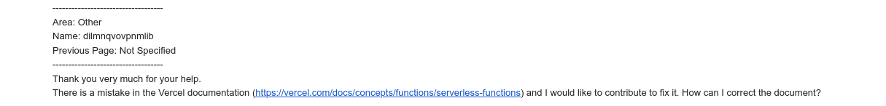
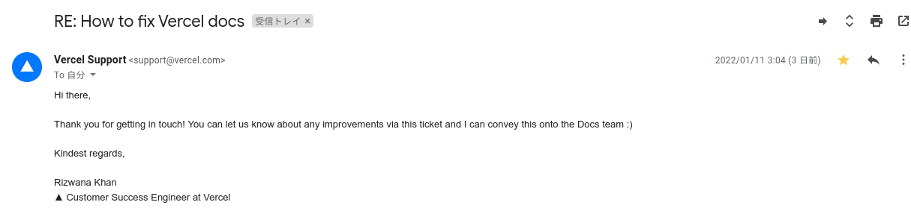
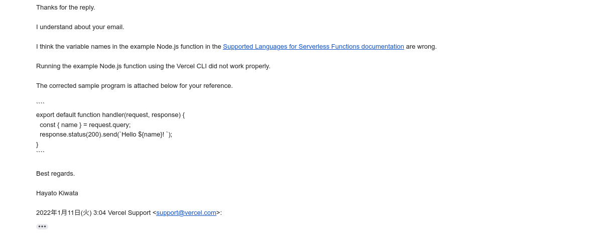
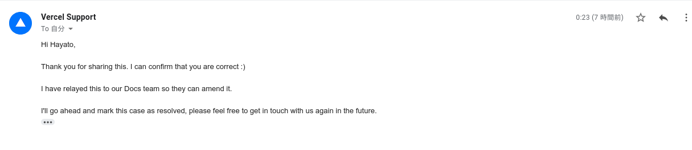

## 概要

- こんにちは :) 最近、FasS 環境を使って Web API をデプロイしたい機会がありました。[Vercel](https://vercel.com) を使って API をデプロイすることにしたのですが、ドキュメントを読んで実装をしていると、サンプルコードの間違いに気づきました。そこで、その真偽を [Velcel Support](https://vercel.com/support) に問い合わせ、修正案を提案するという経験を初めてしました。今回はそこに至るまでの背景や [Velcel Support](https://vercel.com/support) とのやり取りにおいて勉強になったことなどについての記録を残したいと思います。

## 背景

- そもそも、リクエストが飛んでくると簡単なスクリプトを実行する Web API をインターネット上に実装したいと考えていました。しかし、IaaS や PaaS で運用と管理するほどの API でもなくそれほどリクエストも飛ばないと判断したので、今回はイベント駆動形である FaaS を選択しました。

- 次に、どのサービスの FaaS を使うかを検討しました。FaaS の代表格などに [AWS Lambda](https://aws.amazon.com/jp/lambda/) / [Google Cloud Functions](https://cloud.google.com/functions) / [Vercel](https://vercel.com) などが挙げられます。[AWS Lambda](https://aws.amazon.com/jp/lambda/) と [Google Cloud Functions](https://cloud.google.com/functions) は従量課金制度なので、Origin のフィルタリングなどにより、意図しないリクエストをどう弾くかの検討と実装をする必要があります。一方、[Vercel](https://vercel.com) は一つのドメインにぶら下げることができる API が無料枠では 12 個までしかデプロイできないといった制限がありますが、リクエスト回数に制限はありません。(そもそも、クレジットカードを登録していないので、莫大なリクエストが投げられたとしても自分に悪い影響はありません。) また、GitHub と連携させ、リモートに push するとアプリケーションのデプロイを即座に行うことができます。

- こうして、今回は [Vercel](https://vercel.com) を使ってWeb API をデプロイすることにしました。デプロイする言語は何でも良かったので、[サポートしている言語](https://vercel.com/docs/concepts/functions/supported-languages)の内、最近は全く書いていない `TypeScript` を選択しました。

- こうして、 [Vercel](https://vercel.com) に API をデプロイする環境を整え、ドキュメントを読んで試行錯誤していると、`Node.js` 上で実行するためのサンプルコードの間違いに気づきました。

## ドキュメントに間違いを見つけた箇所

- [Supported Languages for Serverless Functions](https://vercel.com/docs/concepts/functions/supported-languages#node.js) の Node.js のサンプルコードには、以下のように記述されていました。`req` と `res` が未定義なので、変数の扱いで間違っていそうです。

```js
export default function handler(request, response) {
  const { name } = req.query;
  res.status(200).send(`Hello ${name}!`);
}
```

- 念の為、[Vercel CLI](https://vercel.com/cli) を使ってエラーを確認しました。そして、エラーを踏まえて、例えば以下のように変数名を変更する必要があります。

```js
export default function handler(request, response) {
  const { name } = request.query;
  response.status(200).send(`Hello ${name}!`);
}
```

- こうして開発環境と本番環境でサンプルコードの間違いと正しいプログラムの実装を確認しました。

## Vercel Support とのやり取り

- 以上を踏まえてドキュメントの修正の報告しようと考えました。しかし、 [vercel/vercel](https://github.com/vercel/vercel/issues/new/choose) のリポジトリの README.md にはドキュメントの修正方法には言及されていませんでした。そのため、ひとまず [vercel/vercel](https://github.com/vercel/vercel/issues/new/choose) のリポジトリの [Issue](https://github.com/vercel/vercel/issues/new/choose) からの報告を検討しました。Issue を立てようとすると、`Bug Report` と `Feature Request` と `Ask a Question` を選択する必要があります。今回の場合は、とりあえず `Bug Report` を選択しました。そうすると、[Vercel Support](https://vercel.com/support/request) のページに遷移したので、そこからドキュメントを修正する問合せなどを行いました。(よくよく考えると、[AWS Support](https://aws.amazon.com/jp/premiumsupport/) と同様に、商用の FaaS のドキュメントに修正は中のエンジニアに依頼する他無いですよね ...) 以下が実際に問合せたメールの内容です。

- Kiwata からの問合せ



- Vercel Support からのメール



- Kiwata からのメール



- Vercel Support からのメール



- こうしてメールで Vercel Support の方とやり取りを行った結果、自分の報告が正しかったようで良かったです :)

## 最後に

- ドキュメントが間違っているという認識があまり無かったので、こうした形ですがサービスの向上に貢献することができて良かったです。[Vercel Support](https://vercel.com/support/request) からメールが返って来た時は意外と嬉しかったです。ゆくゆくは何かの大きい OSS にパッチを投げたいと考えているので、その一歩を踏み出せたのではないかと思いました。

- また、全然関係ないですが、メールにあった `:)` この記号の意味がわかりませんでしたが、よくよく見るとニコチャンマークなのではないかと気づきました。これから自分も多用していきたいと思いました :)

## 参考

- [Vercel サポートにドキュメントの修正の方法について問い合わせる](https://github.com/haytok/apis-for-nodejs-on-vercel/issues/1)
