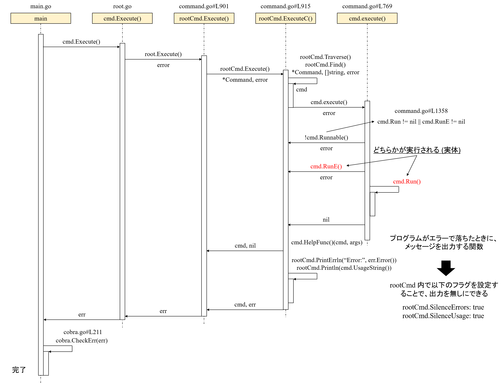

## 概要

- こんにちは :) 最近、[Golang](https://go.dev/) を書くことにハマっています。その一環で [cobra](https://github.com/spf13/cobra) と [viper](https://github.com/spf13/viper) を使って簡単な CLI アプリケーション ([gngc](https://github.com/haytok/gngc/)) を作ってみました。このアプリケーションを実装する際、様々なネットの記事、[公式ドキュメント](https://cobra.dev/)、そして [README.md](https://github.com/spf13/cobra/blob/master/README.md) を読んでみました。しかし、どの実装方法を選択すればわからない場面や出力させたくないエラーメッセージを消す方法がわからない場面などに遭遇することがありました。その際、内部のソースコードを読んで処理の流れや設定の意味などを大まかに調査してみたので、その記録を簡単に残したいと思います。

## 調査内容

- 調査内容は以下の 3 点です。

1. CLI アプリケーションが実行されるまでの流れに関して
2. `rootCmd.Run` と `rootCmd.RunE` の違いに関して
3. [cobra](https://github.com/spf13/cobra) がデフォルトで出すエラーメッセージを出さない方法に関して

## 調査内容 1 (cobra の内部実装)

- [cobra](https://github.com/spf13/cobra) を用いて実装した CLI アプリケーションが実行される大まかな流れを以下の画像のシーケンス図にまとめてみました。(シーケンス図の書き方は完全に正しくはありません ...)



## 調査内容 2 (rootCmd.Run と rootCmd.RunE の違いに関して)

- [cobra](https://github.com/spf13/cobra) でアプリケーションを実装する際、`cmd/root.go` に以下のような初期化を行います。その際、実際に実行されるコマンドは `Run` や `RunE` の箇所に関数を定義します。

```golang
var rootCmd = &cobra.Command{
	Use:           "gngc",
	Short:         "Get and Notify GitHub Contributions",
	Long:          "A simple command line application to get GitHub contributions from GraphQL API and notify them to IFTTT.",
	SilenceErrors: true,
	// SilenceUsage:  true,

	RunE: runCommand,
}
```

- これは、[ドキュメント](https://pkg.go.dev/github.com/spf13/cobra#Command)にも記載されています。しかし、イマイチ使い分けがわからなかったので、内部の実装 ([func (c *Command) execute(a []string) (err error)](https://github.com/spf13/cobra/blob/master/command.go#L769)) を確認してみました。

```golang
func (c *Command) execute(a []string) (err error) {
...
	if !c.Runnable() {
		return flag.ErrHelp
	}
...
	if c.RunE != nil {
		if err := c.RunE(c, argWoFlags); err != nil {
			return err
		}
	} else {
		c.Run(c, argWoFlags)
	}
...
}

func (c *Command) Runnable() bool {
	return c.Run != nil || c.RunE != nil
}
```

- `Run` や `RunE` で設定した関数はこの箇所で呼ばれているようです。このソースコードからもわかるように [func (c *Command) Runnable() bool](https://github.com/spf13/cobra/blob/master/command.go#L1358) で `Run` あるいは `RunE` が定義されているかを確認します。その後に、`RunE` が定義されていると、その関数を呼び出し、結果 (`err`) をその時点で `return` します。そして、この返り値が呼び出し元に伝搬していき、呼び出し元でエラーに応じたハンドリングを行います。

- 一方、`Run` は `RunE` が定義されていない時に呼び出されます。`Run` で定義された関数を呼び出す際、その関数の返り値をハンドリングしないため、その関数内でエラーハンドリングを行い、エラーメッセージを出力する必要があります。そのため、エラーメッセージの出力の実装が散らばってしまう問題があります。

- つまり、`RunE` を用いると、コマンド実行時のエラーをそもそもの呼び出し元の [cmd/root.go](https://github.com/haytok/gngc/blob/main/cmd/root.go) の [func Execute()](https://github.com/haytok/gngc/blob/main/cmd/root.go#L92) でまとめてエラーに応じたエラーメッセージを出力することができます。

## 調査内容 3 (cobra がデフォルト出すエラーメッセージを出さない方法に関して)

- 例えば、存在しないオプションでアプリケーションを実行するとエラーが生じ、それに応じたエラーメッセージが出力されます。この際、当初の自分の実装では、以下のようにエラーメッセージ (`Error: unknown shorthand flag: 'g' in -g`) が重複して出力されていました。

```bash
> go run main.go -g
Error: unknown shorthand flag: 'g' in -g
Usage:
  gngc [flags]

Flags:
      --config string   config file (default is $HOME/.gngc.toml)
  -h, --help            help for gngc
  -n, --notify          Get GitHub contributions and notify them to IFTTT.

Error: unknown shorthand flag: 'g' in -g
exit status 1
```

- このエラーメッセージの重複を回避するために、ソースコードを読んでいると 1 つ目のエラーメッセージを出力している実装は [func (c *Command) ExecuteC() (cmd *Command, err error)](https://github.com/spf13/cobra/blob/master/command.go#L915) 内の `cmd.SilenceErrors` の設定が関係していることに気づきました。

```golang
func (c *Command) ExecuteC() (cmd *Command, err error) {
...
	err = cmd.execute(flags)
	if err != nil {
		// Always show help if requested, even if SilenceErrors is in
		// effect
		if err == flag.ErrHelp {
			cmd.HelpFunc()(cmd, args)
			return cmd, nil
		}

		// If root command has SilenceErrors flagged,
		// all subcommands should respect it
		if !cmd.SilenceErrors && !c.SilenceErrors {
			c.PrintErrln("Error:", err.Error())
		}

		// If root command has SilenceUsage flagged,
		// all subcommands should respect it
		if !cmd.SilenceUsage && !c.SilenceUsage {
			c.Println(cmd.UsageString())
		}
	}
	return cmd, err
}
```

- ドキュメントの [type Command](https://pkg.go.dev/github.com/spf13/cobra#Command) の実装を確認すると、以下のようなコメントが確認できました。この `SilenceErrors` を `true` にして　Silence を有効にする、つまり 1 つ目のエラーメッセージを出力しないようにするように設定すると、エラーメッセージの重複が回避できました。

```golang
type Command struct {
...
	// SilenceErrors is an option to quiet errors down stream.
	SilenceErrors bool

	// SilenceUsage is an option to silence usage when an error occurs.
	SilenceUsage bool
...
}
```

## 結論

- 今回は、[cobra](https://github.com/spf13/cobra) の内部のソースコードを読んで処理の流れや設定の意味などを大まかに調査してみました。ソースコードを読んで実装を理解したり、目的の実装を成し遂げられたことは結構楽しかったです。これからも定期的に自分が使うライブラリのソースコードを読む癖を付けていきたいと思いました :)

## 参考

- [cobra](https://github.com/spf13/cobra)
- [公式ドキュメント](https://cobra.dev/)
