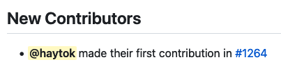

## Overview

I have recently been reading code and sending pull requests for an OSS called [KubeArmor](https://github.com/kubearmor/KubeArmor). In the meantime, My name was listed in the recently released [KubeArmor](https://github.com/kubearmor/KubeArmor) [v0.10.2](https://github.com/kubearmor/KubeArmor/releases/tag/v0.10.2) 🎉🎉🎉 

[KubeArmor](https://github.com/kubearmor/KubeArmor) is a very exciting OSS with Kubernetes, Container, eBPF and Linux kernel. I hope to contribute a lot more !!!
